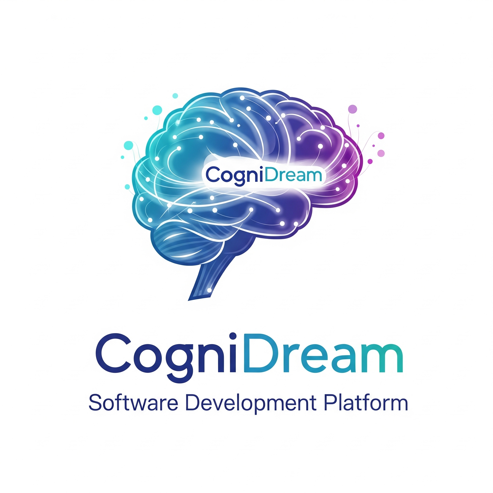

# Welcome to CogniDream Software Developmnent Platform by CogniSynapse LLC & CogniSynapse Technologies Private Limited.

	

CogniSynapse presents, CogniDream.

Use AI agents on your codebase, checkpoint and visualize changes, and bring any model and host locally.

This repo contains the full sourcecode for CogniDream Software Development Platform.

## Contributing

1. To get started working on CogniDream.

## Reference

This is forked on top of Visual Studio Code as the development Environment and the libraries connects to CogniDream Engine as well as mSmartCompute via Ollama Integration as well as direct integration with mSmartCompute API Interface.

## Support
You can always reach the developer (@d3adbra1nvv1v) - Deadbrainviv - vivek@cognisynapse.com
